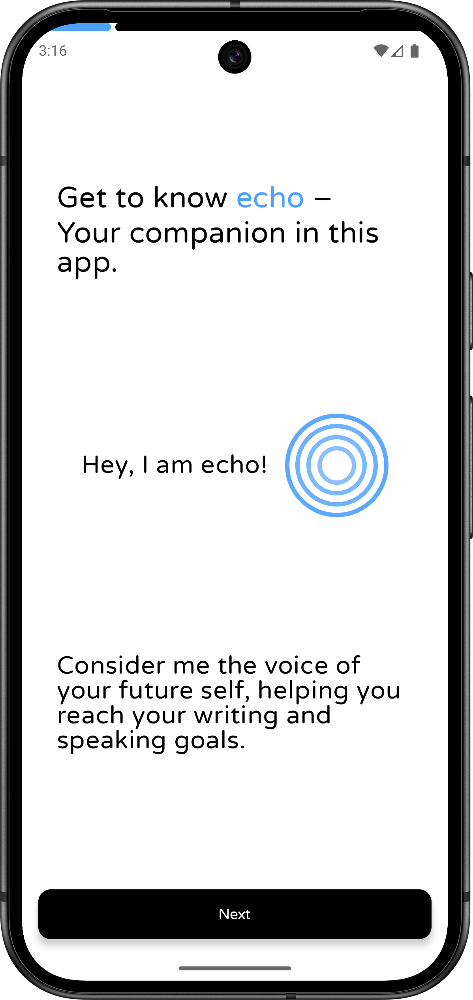
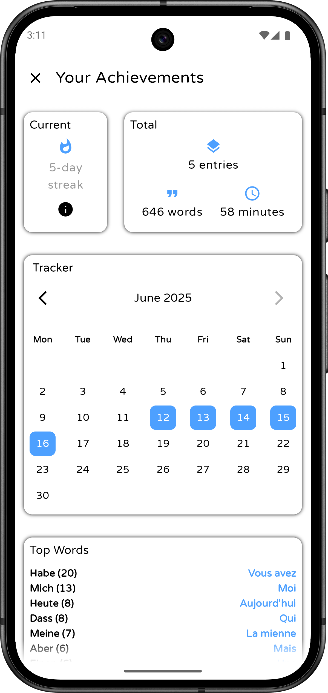

# echo. journal & language practice

Meine Motivation: Mentale Klarheit und Sprachbegeisterung vereinen.
Ich schreibe seit einem Jahr regelmäßig Tagebuch und habe dabei gemerkt, wie sehr mir das Festhalten meiner Gedanken hilft, den Kopf freizubekommen und neue Perspektiven zu gewinnen. Gleichzeitig interessiere ich mich nicht nur für Programmiersprachen, sondern auch für gesprochene Sprachen. Doch im Alltag bleibt oft wenig Zeit, beides konsequent zu verfolgen.

Genau hier setzt meine App-Idee an: echo. journal & language practice kombiniert das schnelle, unkomplizierte Festhalten von Einträgen mit dem spielerischen Lernen einer Fremdsprache. So möchte ich die Vorteile des Tagebuchschreibens – Klarheit, Reflexion, mentale Stärkung – mit dem Reiz des Sprachenlernens verknüpfen und Menschen eine einfache Möglichkeit bieten, beide Routinen gleichzeitig zu pflegen.

**echo. Schreiben, Lernen, Wachsen – jeden Tag.**

echo. journal & language practice ist eine App, die Menschen dabei unterstützt, gute Gewohnheiten wie Tagebuchschreiben und das Lernen von Fremdsprachen gleichzeitig zu etablieren. Sie richtet sich an alle, die **persönliche Reflexion** und **sprachliche Weiterentwicklung** in ihren Alltag integrieren möchten – auch wenn wenig Zeit zur Verfügung steht.

Die App schafft eine motivierende Umgebung, in der Nutzer ihre Gedanken festhalten und dabei spielerisch eine Fremdsprache lernen können. Was echo. besonders macht, ist die Kombination von intuitivem Tagebuchschreiben mit Echtzeit-Übersetzungen und einem KI-Assistenten, der als zukünftiges Ich personalisiert wird, um gezielt zu motivieren und zu unterstützen. So wird Lernen inspirierend, effizient und individuell.

## Design

  
  
  

  
  
  

## Features

### Höchste Priorität (MVP)
- [x] Tagebuch Einträge Übersicht
- [x] Tagebuch Einträge Favoritenliste
- [x] Tagebuch Schreiben und speichern
- [x] Sprachübersetzung in relevante Sprachen
- [x] echo's inspirierende Schreibanregungen
- [x] Zielsprache auswählen und wechseln
- [x] User Profil und generelle Settings
- [x] User Adden und Einträge teilen
### Mittlere Priorität
- [x] Echtzeit-Übersetzung
- [x] Personalisiertes Top Words Ranking mit Wörterbuchfunktion
- [x] Schreib-Statistik
- [x] Schreib-Tracker
- [x] Text-zu-Sprache für gelernte Sprache
- [x] Voice to Text
### Niedrige Priorität
- [ ] Bilder aus Fotos einfügen
- [ ] Orte aus Maps einfügen
- [ ] Audio Records to Text
- [ ] Vokabel-Highlighting
+ siehe unten -> Ausblick

## Technischer Aufbau

#### Projektaufbau

	echojournal/
	├── data/
	│   ├── local
	│   ├── remote
	│   └── repository
	├── di/
	│   └── xxx
	├── navigation/
	│   └── xxx
	├── ui/
	│   ├── components
	│   ├── screens
	│   ├── theme
	│   └── viewModel
	├── util/
	│   └── xxx
    ├── AppStart.kt
	└── MainActivity

    

	Der Datenfluss geht dabei typischerweise: View <-> ViewModel <-> Repository <-> External Sources

##### 1. data - local/remote inkl. models

Aufgabe: Definieren die Datenstrukturen/Objekte der App (z.B. JournalEntry, User)

Structs: Tagebucheintrag (JournalEntry), Nutzerprofil (User), ggf. weitere: (Übersetzung (Translation), Schreibanregung (Prompt), ...).

##### 2. ui - viewModel

Aufgabe: Implementieren die Business-Logik und koordinieren verschiedene Repos

ViewModels:

- Tagebucheinträge anzeigen und verwalten (JournalViewModel: loadEntries(), addEntry(), deleteEntry()).

- ggf. weitere (Benutzerinformationen verwalten (UserViewModel: loadUser(), updateLanguage()), Texte übersetzen (TranslationViewModel: translateText()), Schreibanregungen laden (PromptViewModel: loadDailyPrompt()).

##### 3. ui - screens, components, theme

Aufgabe: Zeigen die UI an und nehmen User-Interaktionen entgegen

screens:

- Eintragsübersicht (EntryListScreen),

- Detaileintrag neu/änderbar (NewEntryScreen, EntryDetailScreen),

- Login (SignInSignUpScreen),

- ggf. weitere (Sprache auswählen (LanguagePickerScreen), Einstellungen (SettingsScreen), ...).

##### 4. data - repositories

Aufgabe: Kümmern sich um die technische Kommunikation mit externen APIs/Systemen (Firebase, LibreTranslate)

- Firebase-Kommunikation (FirebaseRepo),

- LibreTranslateAPI-Docker-Container-Kommunikation (TranslationRepo).

Repos:

- Einträge laden und speichern (JournalRepo: fetchEntries(), saveEntry(), deleteEntry()),

- Texte übersetzen (TranslationRepo: translateText()),

- ggf. weitere (Benutzerprofil verwalten (UserRepo: getUser(), updateUser()), Schreibanregungen bereitstellen (PromptRepository: getDailyPrompt(), fetchPrompts(), ...).

#### Datenspeicherung

##### Welche Daten?

- Tagebucheinträge: Titel, Inhalt, Datum, Tags, Sprache, Übersetzungen.

- Benutzerprofile: Name, Zielsprache, Einstellungen.

- Schreibanregungen: Tägliche Inspirationen.

##### Wo und wie?

- Firebase: Hauptspeicherort für Daten.

- Warum Firebase? Echtzeit-Synchronisation zwischen Geräten. Skalierbarkeit und einfache Integration. Möglichkeit für späteren Offline-Support.

- Lokaler Speicher AppData für Daten wie Onboarding Bool und gewähltes Farbschema.

#### API Calls

LibreTranslate API: Übersetzung von Texten in die Zielsprache. Übersetzen von Tagebucheinträgen und Bereitstellen von Synonymen/Definitionen.

Warum: Open-Source-Lösung ohne Lizenzkosten, sofern Selbst-gehostet. Unterstützt mehrere Sprachen.

**Extra Herausforderung:** Selbst-Hosten ist wegen der API notwendig, da die Nutzung über die LibreTranslate Server nicht kostenfrei ist! -- **Docker Container** -- **Cloud Server** -- **HTTPS Website**

Zukünftige API-Erweiterungen für bspw echos' KI-Funktionen können später ergänzt werden.

## Ausblick

1.	**Summaries & Reviews**
      Automatisierte Wochen- oder Monatsrückblicke anhand der geschriebenen Einträge – so lassen sich persönliche Fortschritte im Journalen und Sprachenlernen übersichtlich nachvollziehen.

2.	**Community-Features**
      Einbindung anderer Nutzer: Gemeinsame Journals, das Austauschen von Einträgen oder Feedback und damit ein soziales Element, das zusätzlich motiviert.

3.	**Echo-Assistent Customizing**
      Das virtuelle Zukunfts-Ich lässt sich individuell anpassen und personalisieren: Nutzer können die Persönlichkeit, den Schreibstil oder sogar den Avatar ihres KI-Assistenten definieren.

